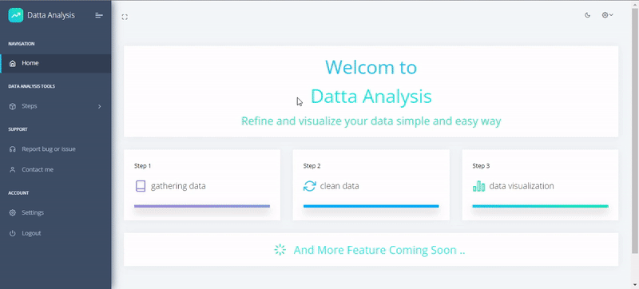
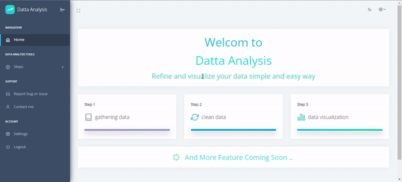
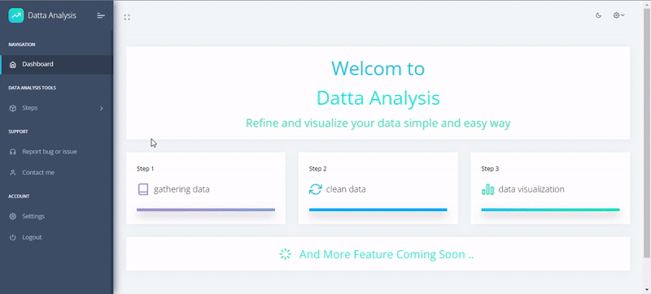

# Data: Data Analysis, Cleaning, and Visualization Django App

## Overview

Data is a Django web application designed for data analysis, cleaning (refining), and visualization. This app streamlines the process of handling and preparing data for analysis, making it a valuable tool for data scientists, analysts, and researchers.

## Features

- **Data Analysis:** Perform exploratory data analysis (EDA) with statistical summaries, distribution plots, and correlation matrices.
  
- **Data Cleaning (Refining):** Cleanse and preprocess your data with features such as handling missing values, removing duplicates, and transforming variables.

- **Data Visualization:** Visualize your data with interactive charts, graphs, and customizable plots for better insights.

- **User-Friendly Interface:** The app provides an intuitive and user-friendly interface for easy navigation and interaction.

- **Screenshot Integration:** Easily capture and reference your data analysis and visualization work by taking and attaching screenshots within the app.

## Screenshots








## Installation

1. Clone this repository to your local machine:

   ```bash
   git clone https://github.com/yourusername/data-deliver.git

2. Navigate to the project directory:

   ```bash
   cd data-deliver

3. Install the required dependencies:

   ```bash
   pip install -r requirements.txt

4. Apply database migrations:

   ```bash
   python manage.py migrate

5. Run the development server:

   ```bash
   python manage.py runserver


## Usage

1. Create a superuser account to access the admin panel:

   ```bash
   python manage.py createsuperuser

Follow the prompts to set up your superuser credentials.

2. Start the development server:

   ```bash
   python manage.py runserver

3. Visit http://localhost:8000/admin and log in with your superuser credentials.

4. Use the Data Deliver app to perform data analysis, cleaning, and visualization.

